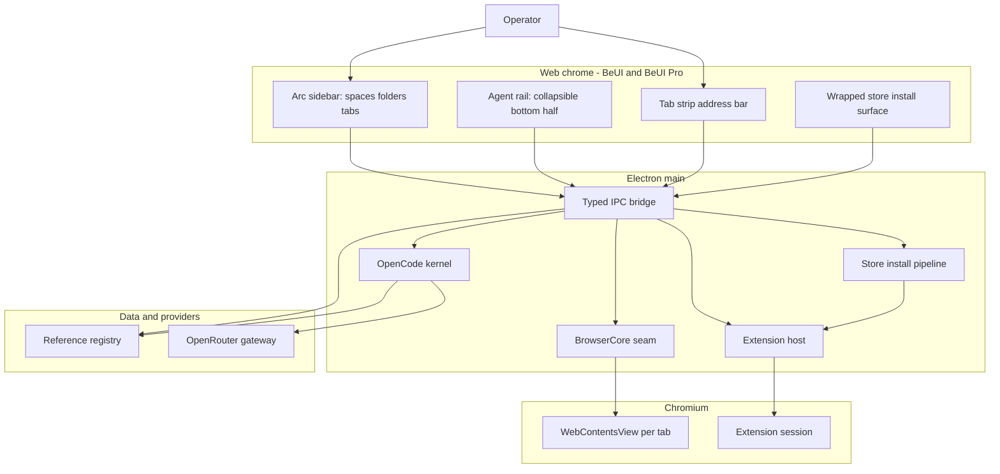

# Zenmium architecture

Zenmium is one Electron application: a web chrome, Chromium content, and an embedded agent plane. A single Arc-style sidebar is the shared control surface. The browser owns the top of it; the agent owns a collapsible bottom section with a right-aligned caret.

## System map

Green is working or packaged, red is missing live evidence. In this state every node is planned until CI builds and the app runs.

## Technical description

- Web chrome. React 19 and Tailwind v4, built from BeUI and BeUI Pro. It owns presentation and interaction only: the sidebar, tab strip, address bar, extension store surface, and agent rail.
- Main process. Owns window lifecycle, the security policy, the `BrowserCore` seam, the extension host, the store install pipeline, and the OpenCode kernel.
- BrowserCore. `WebContentsView` per tab. The chrome sends typed IPC; the core creates, activates, navigates, and closes views and emits `BrowserEvent`s back. Product features never touch Chromium directly.
- Extension host. Persists a registry at `userData/zenmium/extensions.json`, reloads enabled unpacked extensions on boot, and exposes list, load, remove, and setEnabled.
- Store install pipeline. Turns a store id or detail URL into an installed unpacked extension: resolve, download, verify, extract, install, with progress events (see `STORE-INSTALL.md`).
- Agent plane. `opencode serve` on a loopback port, reached through `@opencode-ai/sdk`. BYO agents attach through MCP and ACP.
- Reference registry. One addressable object store over product bookmarks and files, reachable from the UI and agent tools.

## Ownership and protected zones

| Surface | Owner | Protected zone |
| --- | --- | --- |
| Chrome presentation | BeUI, BeUI Pro, product renderer | Product state, routing, and security stay out of the UI library |
| Browser control | `BrowserCore` plus main process | No renderer code touches Chromium directly |
| Extensions | Extension host and store pipeline | The compat matrix is enforced; no overclaiming |
| Agent sessions | OpenCode kernel | No second agent loop |
| Model routing | OpenRouter gateway | Keys never reach the renderer, a log, or a model |
| References | Reference registry | One id used identically in UI, IPC, and tools |
| Security policy | `src/main/security.ts` | CSP, permission handler, and egress allowlist centralized |

## Extension model

Electron supports a documented subset. The host and store pipeline enforce a compat matrix; unsupported calls fail closed `{ ok, status, reason }`.

| Capability | v1 | Notes |
| --- | --- | --- |
| Load unpacked | Yes | `session.extensions.loadExtension`, reloaded every boot |
| Load `.crx` | No | The store pipeline unzips the CRX to a managed directory first |
| Chrome Web Store install | Via our flow | We parse the id, fetch the CRX from the update endpoint, verify, extract, load. No store impersonation, no credit |
| MV2 background | Yes | MV3 service worker not supported |
| `chrome.scripting`, `webRequest`, `devtools.*` | Full | Per Electron docs |
| `runtime`, `tabs`, `storage.local`, `management` | Partial | No `storage.sync` |
| `bookmarks`, `nativeMessaging`, `declarativeNetRequest`, `identity` | No | Owned by product code; never advertised |

## Security model

- Page content is untrusted. The agent never follows page instructions; navigation and local-file access require explicit approval.
- The chrome renderer runs under a strict CSP and has no Node access.
- Permissions are deny-by-default, https and a small allowlist only.
- Egress is limited to the OpenRouter gateway and an explicit destination allowlist.
- Secrets live in 1Password and are used through the browser extension in Zen. Config stores names only.
- Supply chain: Renovate with age gates, OSV and Grype scanning, Semgrep, gitleaks, and a Syft SBOM per release.

## Stack

| Layer | Choice |
| --- | --- |
| Shell | Electron, TypeScript, `electron-vite` |
| Chrome UI | React 19, Tailwind v4, BeUI, BeUI Pro |
| Content | Chromium via `WebContentsView`; `BrowserCore` seam |
| Agent kernel | OpenCode (`opencode serve`, `@opencode-ai/sdk`, MIT) |
| Model gateway | OpenRouter; default `deepseek/deepseek-v4.1-flash` |
| State | Zustand in the chrome; Reference registry for durable objects |
| Motion | `motion` only, one runtime |
| Build | GitHub-hosted macOS runners |
| Secrets | 1Password browser extension in Zen; names only |
