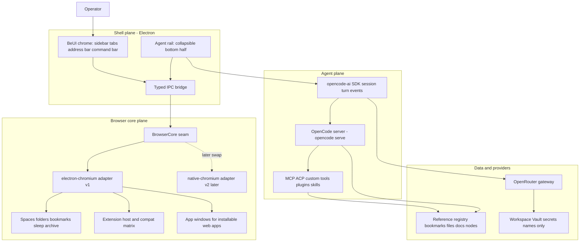

# Zenmium architecture

Zenmium is one application with three cooperating planes: a web-technology shell, a Chromium
content core organized as tabs and spaces, and an embedded agent plane. A single Arc-style
sidebar is the shared control surface. The browser owns the top of that sidebar; the agent owns a
collapsible bottom section with a right-aligned caret that carries its state.

## System map

Green = working or packaged; red = missing live evidence. In this planning state there is no
live source, so treat every node as planned.

## Plain-English description

Think of Zenmium as a house with three floors and one staircase. The staircase is the sidebar.
The top floor is the browser: spaces, tabs, folders, bookmarks, and the web pages themselves.
The bottom floor is the agent: a chat and control surface that can be collapsed or opened with a
small caret on the right edge. The basement is the plumbing that connects both floors to real
engines: one Chromium for pages, one agent runtime for the assistant, and one gateway for models.

The web pages are the only part the user does not build. Everything around them — the sidebar,
the tab strip, the address bar, the agent rail — is web technology, which is why BeUI can style
the entire product. The browser engine sits behind a seam so we can start on Electron and later
replace it with a native Chromium core without rewriting the chrome or the agent.

## Technical description

- **Shell plane (Electron).** The main process owns windows, the `BrowserCore` seam, the OpenCode
  server, permissions, and the extension host. Renderers hold the BeUI chrome and the agent rail.
  All cross-plane traffic goes through a typed IPC bridge with context isolation on.
- **Browser core plane.** Each tab is a Chromium `WebContentsView`. A `BrowserCore` interface
  abstracts navigation, tab lifecycle, sessions, extensions, and app windows. v1 implements it
  with Electron; v2 can implement it with a native Chromium or CEF core. Product features
  (spaces, folders, bookmarks, sleep, archive) sit above the seam and stay engine-agnostic.
- **Agent plane.** An embedded `opencode serve` process exposes a local HTTP/SSE API. The rail
  talks to it through `@opencode-ai/sdk`. The agent reaches files, bookmarks, docs, and canvas
  nodes through the Reference registry and custom tools. BYO agents attach through MCP/ACP.
- **Data and providers.** The Reference registry is the single addressable object store. The
  OpenRouter gateway is the only model egress. Secrets live in the Workspace Vault; only names
  appear in context, config, or logs.

## Ownership and protected zones

| Surface | Owner | Protected zone |
| --- | --- | --- |
| Shell chrome, sidebar, rail presentation | BeUI / BeUI Pro + Zenmium UI package | Product state, routing, and security never move into the UI library |
| Tab lifecycle, navigation, sessions | Browser core seam | No product feature depends on Electron-only types above the seam |
| Extensions and app windows | Extension host package | Chrome extension API surface is documented and tested, never claimed beyond the matrix |
| Agent sessions, turns, events | OpenCode kernel | Zenmium does not write a second agent loop |
| Model routing and keys | Provider gateway | Raw keys never reach a renderer, log, or model |
| Reference registry | Reference package | Every object has one id used identically in UI, IPC, and agent tools |
| Security policy | Security package | CSP, permission handlers, egress allowlist, and injection defenses are centralized |

## Data flow

1. The operator acts in the BeUI chrome or the agent rail.
2. The renderer sends a typed IPC message.
3. Browser actions resolve at the `BrowserCore` seam; agent actions resolve at the OpenCode server.
4. Chromium or the agent emits state; the shell subscribes and re-renders.
5. Any durable object is written through the Reference registry with a stable id.

## Chrome extension model (v1, Electron)

Electron supports a documented subset. The extension package must publish and enforce a compat
matrix; unsupported APIs fail closed with `{ ok, status, reason }`.

| Capability | v1 status | Notes |
| --- | --- | --- |
| Load unpacked extension | Supported | `session.extensions.loadExtension(path)`; must reload each boot; persistent session only |
| Load `.crx` | Not supported | Pipeline must download and unzip the CRX to a directory first |
| Chrome Web Store install | Not available | Provide an in-app sideload flow instead; document the difference |
| `chrome.devtools.*`, `chrome.scripting`, `chrome.webRequest` | Supported | Full per Electron docs |
| `chrome.runtime`, `chrome.tabs`, `chrome.storage.local`, `chrome.management` | Partial | Storage sync/managed unsupported |
| `chrome.bookmarks`, `nativeMessaging`, `declarativeNetRequest` | Not supported | Own these in product code; never advertise otherwise |
| Manifest V2 background | Supported key | MV3 background service worker not documented as supported |

**v2 path.** If full parity becomes gating, implement `native-chromium` behind the same seam and
carry the compat matrix forward. The chrome and agent do not change.

## Security model

- Electron hardened defaults: `contextIsolation: true`, `sandbox: true`, `nodeIntegration: false`,
  a strict CSP on chrome renderers, and a permission request handler that denies by default.
- Page content is untrusted data. The agent never follows instructions from a page; navigation and
  local-file access require explicit, scoped approval. The Reference registry is allowlist-based.
- Egress is limited to the OpenRouter gateway and an explicit destination allowlist.
- Secrets live in the Workspace Vault. Config stores names only.
- Supply chain: Renovate with age gates, OSV/Grype dependency scanning, Semgrep SAST, gitleaks
  secret scanning, and a Syft SBOM per release. Chromium security reaches Zenmium by Electron
  dependency bump on its 8-week even-version cadence.

## Stack

| Layer | Choice |
| --- | --- |
| Shell | Electron, TypeScript |
| Chrome UI | React 19, Tailwind CSS v4, BeUI, BeUI Pro (gated blocks) |
| Content | Chromium via Electron `WebContentsView`; `BrowserCore` seam |
| Agent kernel | OpenCode (`opencode serve`, `@opencode-ai/sdk`, MIT) |
| Agent extensions | MCP, ACP, custom tools, plugins, skills |
| Model gateway | OpenRouter; default `deepseek/deepseek-v4.1-flash` |
| State | Zustand for shell state; Reference registry for durable objects |
| Motion | `motion` only (one runtime; remove any second runtime) |
| Icons | Iconly facade |
| Build | pnpm + Turborepo; GitHub-hosted ARM64 macOS runners |
| Secrets | Workspace Vault (names only: `BEUI_PRO_TOKEN`, `OPENROUTER_API_KEY`) |

## Unverified or to confirm

- Electron extension behavior against a pinned set of real extensions (needs a compat test).
- Whether an app-window wrapper satisfies the operator's wonder.so expectation fully.
- BeUI Pro token availability. The token is not yet in the vault by this plan.
- Exact OpenCode Windows/Linux packaging path for a later cross-platform release.
