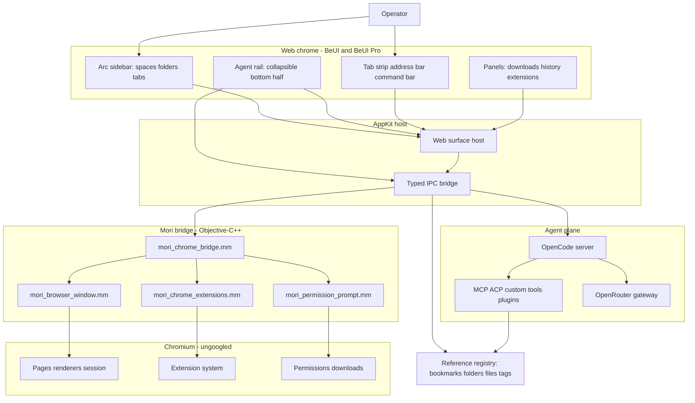

# Zenmium architecture

Zenmium is Mori's Chromium engine and bridge wearing a web chrome. The entire product UI is a web surface built from BeUI and BeUI Pro. A thin AppKit host presents that surface and hands browser control to Mori's Objective-C++ bridge. Chromium still owns pages, renderers, extensions, permissions, and downloads.

## System map

Green is working or packaged, red is missing live evidence. In this planning state every node is planned.

## Plain-English description

Mori is a real Chromium engine with a Mac app around it. Today that Mac app is built in SwiftUI. Zenmium keeps the engine and the wiring, and rebuilds the app around it out of web parts, so the BeUI library can style everything. Think of a car where we keep the engine, the transmission, and the dashboard wiring, and replace the dashboard itself with one we can shape freely.

The dashboard is the whole product: the Arc sidebar, the tab strip, the address bar, the panels, and the agent rail. It runs in a web view. When you click a tab or type a URL, the web view does not touch Chromium directly. It sends a typed message to a bridge, the bridge calls Mori's Objective-C++ layer, and Chromium does the real work. Browser state flows back the same way, so the web surface always reflects the engine.

## Technical description

- Web chrome. A React 19 and Tailwind v4 application built from BeUI and BeUI Pro. It owns presentation and interaction only. It renders the Arc sidebar (spaces, pinned and today tabs, folders), the tab strip, the address bar, the command bar, the panels, and the agent rail.
- AppKit host and chrome surface. A privileged Chromium WebContents renders the chrome, served from local app resources and isolated from page content. This is the best-practice shape for a Chromium browser: one engine, one process model, and direct access to Chromium theming and devtools. A WKWebView was rejected because a second web engine adds memory and inconsistent rendering. The host owns window lifecycle, menus, and layout.
- Typed IPC bridge. A single typed API between the web chrome and Mori's Objective-C++ bridge. Commands: tab lifecycle, navigation, space and folder moves, bookmark and reference writes, extension actions, downloads, and permission prompts. Every call returns `{ ok, seam, reason }` and fails closed.
- Mori bridge. Unchanged in ownership. `mori_chrome_bridge.mm`, `mori_browser_window.mm`, `mori_chrome_extensions.mm`, and `mori_permission_prompt.mm` translate commands into Chromium operations and forward state back.
- Chromium. Pages, renderers, session, extensions, permissions, and downloads stay with the engine.
- Agent plane. An embedded `opencode serve` process exposes a local HTTP and SSE API. The rail talks to it through `@opencode-ai/sdk`. BYO agents attach through MCP and ACP.
- Reference registry. One addressable object store for bookmarks, folders, URLs, files, and tags, reachable from the UI and from agent tools.

## Ownership and protected zones

| Surface | Owner | Protected zone |
| --- | --- | --- |
| Web chrome presentation | BeUI, BeUI Pro, product UI package | Product state, routing, security, and the agent session never move into the UI library |
| Browser control | IPC bridge plus Mori Objective-C++ | No product feature calls Chromium directly; every call goes through the bridge |
| Engine behavior | Chromium | Pages, renderers, session, and extension execution stay with the engine |
| Agent sessions | OpenCode kernel | No second agent loop |
| Model routing | OpenRouter gateway | Raw keys never reach the web chrome, a log, or a model |
| Reference registry | Reference package | Every object has one id used identically in the UI, IPC, and agent tools |
| Security policy | Security package on the host | CSP, permission handlers, egress allowlist, and injection defenses are centralized |

## Data flow

1. The operator acts in the web chrome.
2. The web surface sends a typed IPC message.
3. The bridge resolves it through Mori's Objective-C++ layer, or the agent plane resolves it through the OpenCode server.
4. Chromium or the agent emits state; the bridge forwards it and the web chrome re-renders.
5. Any durable object is written through the Reference registry with a stable id.

## Agent rail

The sidebar is one column. The top half is browser navigation. The bottom half is the agent rail: a BeUI Chat App surface that collapses to a bar with a right-aligned caret carrying state (idle, working, blocked, done). It runs in the same web surface as the rest of the chrome and reaches the OpenCode kernel over localhost. Collapsing the rail keeps the session alive.

## Reference registry

Mori already persists bookmarks, folders, contexts, history, and archives. The registry wraps those stores in stable ids so the agent can be pointed at an object by tag.

| Scheme | Meaning | Backed by |
| --- | --- | --- |
| `ref:bookmark/<slug>` | A saved bookmark | Mori `BookmarkStore` |
| `ref:folder/<slug>` | A tab or bookmark folder | Mori `TabFolder` |
| `ref:url/<hash>` | A live or historical URL | Tab or `HistoryStore` |
| `ref:file/<path>` | A local file or repo path | Local filetree |
| `ref:node/<id>` | A canvas or map node | Product store |

## Chrome extension model

Mori already runs ungoogled-chromium and ships `mori_chrome_extensions.mm`, so extension execution is native to the engine. The parity work is in the ungoogled path and the update path, not a reimplementation. The ticket slate in `ISSUES.md` covers the Web Store install flow, the post-update re-disable, Widevine, and MV2. The extension host publishes an enforced compat matrix; unsupported calls fail closed.

## Security model

- Page content is untrusted data. The agent never follows instructions from a page; navigation and local-file access require explicit, scoped approval.
- The web chrome runs under a strict content security policy and has no direct engine access; all control flows through the typed bridge.
- Egress is limited to the OpenRouter gateway and an explicit destination allowlist.
- Secrets live in 1Password and are used through the browser extension in Zen. Config stores names only.
- Supply chain: Renovate with age gates, OSV and Grype scanning, Semgrep, gitleaks, and a Syft SBOM per release. Chromium security reaches Zenmium by rebuilding the engine on upstream security releases, planned as a pipeline, not a dependency bump.
- Harden the Mori audit findings: prompt-injection bounds, passkey handling, local agent server auth, automation read redaction, and CRX install validation.

## Stack

| Layer | Choice |
| --- | --- |
| Base engine and bridge | Mori, ungoogled-chromium, Objective-C++ |
| Host | Thin AppKit host presenting a privileged Chromium WebContents chrome |
| Chrome UI | React 19, Tailwind CSS v4, BeUI, BeUI Pro |
| Motion | `motion` only, one runtime |
| Icons | Iconly facade |
| Agent kernel | OpenCode (`opencode serve`, `@opencode-ai/sdk`, MIT) |
| Agent extensions | MCP, ACP, custom tools, plugins, skills |
| Model gateway | OpenRouter; default `deepseek/deepseek-v4.1-flash` |
| State | Zustand in the web chrome; Reference registry for durable objects |
| Build | Mori GN/ninja on a Cloud macOS runner; web chrome built with pnpm |
| Secrets | 1Password browser extension in Zen; names only: `OPENROUTER_API_KEY`, `BEUI_PRO_TOKEN` |

## Unverified or to confirm

- The mechanics of a privileged WebContents chrome (a WebUI-style surface) in the Mori GN target, including strict isolation from page content.
- The cost of replacing Mori's SwiftUI chrome layer without disturbing the GN target list.
- Electron extension behavior against a pinned set of real extensions is no longer relevant; the Chromium compat test still applies.
