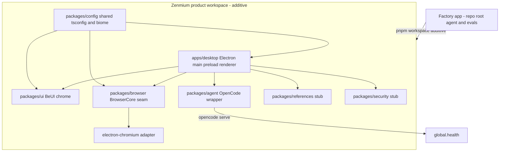

# S001-P0 — Zenmium shell scaffold

Status: planned. Owner: poteto-agent-1 (implementer). Reviewer: supervisor on the pushed branch. Parent spec: `docs/zenmium/PLAN.md` (S001), `docs/zenmium/ARCHITECTURE.md`.

## Original problem

Zenmium has a spec and a factory but no source. Nothing downstream (agent rail, references, extensions, security) can be built or proven until a runnable shell exists: one Electron window, a real Chromium tab, the BrowserCore seam, and a live OpenCode kernel probe. This tranche creates that floor.

## Outcome

Deliver the Zenmium shell so the operator can launch a packaged macOS app, open a real site in a Chromium tab through the BrowserCore seam, see a BeUI-styled Arc sidebar skeleton, and confirm the embedded OpenCode server is healthy. The agent rail, references, extensions, and the security package stay stubbed until later tranches.

## Prerequisites (factory, separate from this tranche)

The factory must be able to run before it can execute this tranche.

1. Deploy the factory with `eve deploy` and provision GitHub and Linear connectors with `vercel connect`.
2. Set `GITHUB_CONNECTOR`, `LINEAR_CONNECTOR`, and `FACTORY_REPO=nicharacci/zenmium` in the Vercel project.
3. Install the GitHub App behind `GITHUB_CONNECTOR` with access to `nicharacci/zenmium`.
4. Run product builds on a GitHub-hosted ARM64 macOS runner. Local is at Critical capacity (8.3 GB free), so no local checkout or build.

## System map



Working or packaged areas are the factory app and this plan. Every product node is red until the tranche lands.

## Workspace integration

The factory app owns the repo root (`agent/`, `evals/`, root `package.json`, root `tsconfig.json`). The product is added as a pnpm workspace beside it.

- `pnpm-workspace.yaml`: add `packages: ["apps/*", "packages/*"]` above the existing `allowBuilds` block.
- Root `tsconfig.json`: leave scoped to `agent/**` and `evals/**`. Each product package gets its own `tsconfig.json` extending `packages/config/tsconfig.base.json`.
- `biome.jsonc`: add overrides for `apps/**` and `packages/**` so React, JSX, and Electron code do not fight the factory's Ultracite rules. Keep the factory's rules unchanged.
- `pnpm validate` must stay green for the factory after every batch. Product typecheck runs through `pnpm -r typecheck`.

## Exact paths

Create these. Names are fixed so later tranches can address them.

```text
apps/desktop/
  package.json
  tsconfig.json
  electron.vite.config.ts
  src/main/index.ts
  src/main/security.ts
  src/preload/index.ts
  src/renderer/index.html
  src/renderer/main.tsx
  src/renderer/App.tsx
packages/config/
  package.json
  tsconfig.base.json
  biome.json
  tailwind.preset.css
packages/ui/
  package.json
  src/Sidebar.tsx
  src/TabStrip.tsx
  src/AddressBar.tsx
packages/browser/
  package.json
  src/BrowserCore.ts
  src/electron-chromium.ts
packages/agent/
  package.json
  src/kernel.ts
packages/references/
  package.json
  src/Reference.ts
packages/security/
  package.json
  src/policy.ts
```

## Batches

Each batch is one commit and one checkpoint. Run the batch's check before the next.

- B1 Workspace wiring. `pnpm-workspace.yaml`, `packages/config`, per-package tsconfigs, biome overrides. Check: factory `pnpm validate` green, `pnpm -r typecheck` green.
- B2 Electron shell. Main, preload, renderer, hardened defaults in `src/main/security.ts`. Check: app launches, build produces a macOS app bundle.
- B3 BrowserCore seam. Interface plus `electron-chromium` adapter, one real tab with back, forward, reload, and an address bar. Check: navigate a real site and exercise navigation.
- B4 BeUI sidebar and kernel probe. Sidebar skeleton from BeUI components, embedded `opencode serve` with a `global.health` call surfaced in the UI. Check: sidebar renders, health reports healthy.

## Dependencies

`electron`, `electron-builder`, `electron-vite`, `typescript`, `react`, `react-dom`, `tailwindcss` v4, `@tailwindcss/postcss`, `motion` (one motion runtime only), `zustand`, `zod`, `@opencode-ai/sdk`, `vitest`. BeUI components are added from the `@beui` shadcn registry as copy-source, with BeUI Pro from the private registry when a gated block is needed.

## Acceptance checks

- Given the repo, when I run the factory validate command, then check, typecheck, and `eve info` all report zero errors and the product workspace resolves.
- Given a built Zenmium app, when I launch it, then one window opens with the BeUI sidebar, tab strip, and address bar, and no Node access in the renderer.
- Given the app, when I enter a real URL, then a Chromium tab loads the page and back, forward, and reload work through the BrowserCore interface.
- Given the app, when it starts, then the embedded OpenCode server responds healthy and the state shows in the sidebar footer.
- Given the packaged app, when I quit, then it exits cleanly with no crash.

## Proof rungs

Source (branch pushed), build (`pnpm -r build` plus the packaged app on the Cloud macOS runner), installed app (operator launches `Zenmium.app`), and a short interaction recording for the sidebar, navigation, and health probe. The highest rung for this tranche is the installed app.

## Protected zones

- The factory's `agent/`, `evals/`, root scripts, and `biome.jsonc` factory rules. Product changes must not alter factory behavior. `pnpm validate` is the guard.
- One motion runtime. Do not add a second animation library.
- Secrets. `OPENROUTER_API_KEY` and `BEUI_PRO_TOKEN` are names only. Values live in 1Password and are resolved with `op` at the point of use, or through the 1Password extension in Zen for web work. Nothing secret reaches the renderer, a log, or git. See `docs/zenmium/SECRETS.md`.
- The OpenCode kernel is the only agent loop. Do not add a second.

## Rollback

The tranche is additive. Revert the tranche branch to remove `apps/` and `packages/` and restore `pnpm-workspace.yaml`, `biome.jsonc`, and `PROJECT-STATE.md`. The factory app is untouched, so reverting cannot break it.

## Return path

Push the tranche branch, open a draft PR with the acceptance checklist, and hand to the supervisor station for an independent verdict on the real diff. The reviewer checks the BrowserCore seam does not leak Electron types into product features, that the renderer has no Node access, and that the factory validate command stayed green.

## Risk register

- Biome friction. Ultracite may reject React and Electron idioms. Mitigation: scoped overrides in `biome.jsonc`, decided in B1 before any component work.
- Electron extension expectations. None are built in this tranche. The compat matrix lands in P4.
- OpenCode boot timing. The server may not be ready when the window opens. Mitigation: async health poll with a visible starting state, never a blocking wait.
- Disk gate. No local checkout or build. All builds run on the Cloud macOS runner.
- CSP and preload. A strict content security policy can break renderer dev tooling. Mitigation: separate dev and production policy in `src/main/security.ts`.

## Secrets manifest

Names only: `OPENROUTER_API_KEY`, `BEUI_PRO_TOKEN`. Values come from 1Password and are resolved with `op` at the point of use. No values in this plan, the repo, config, or logs. See `docs/zenmium/SECRETS.md`.
