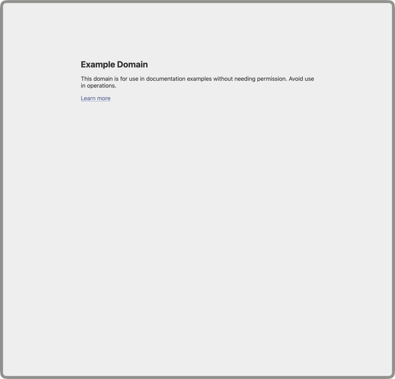
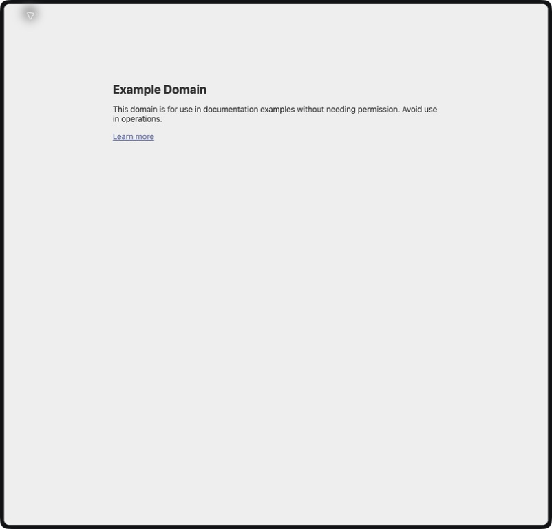
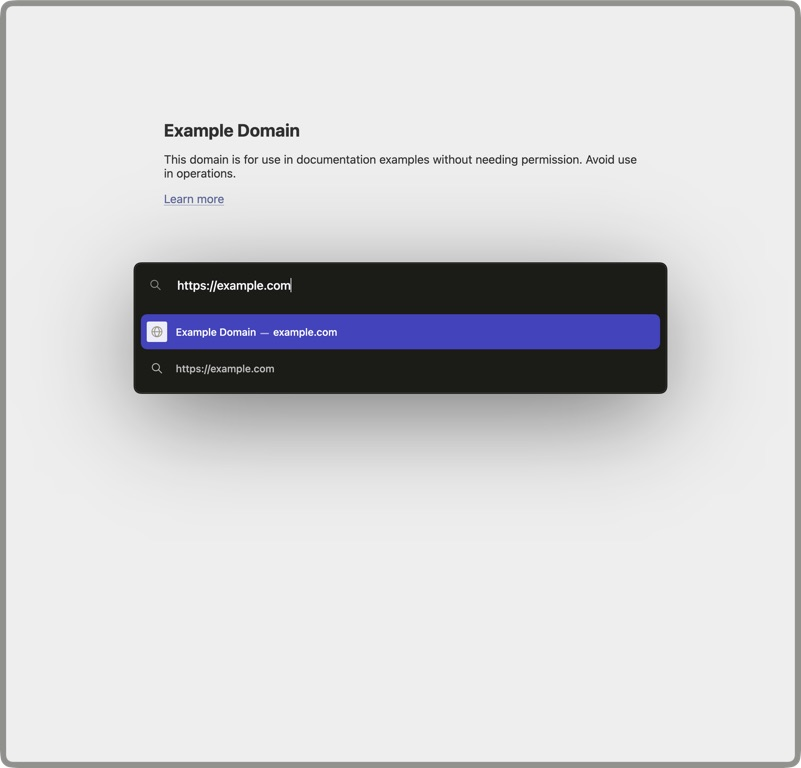
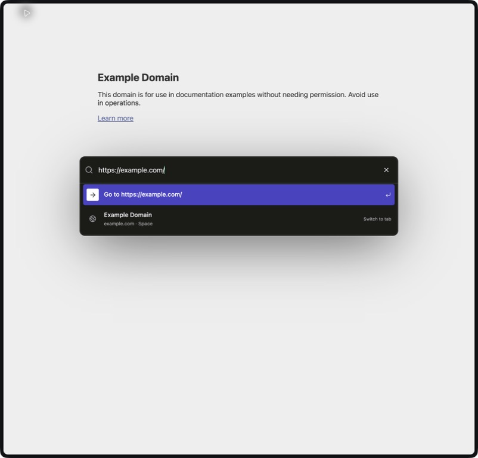
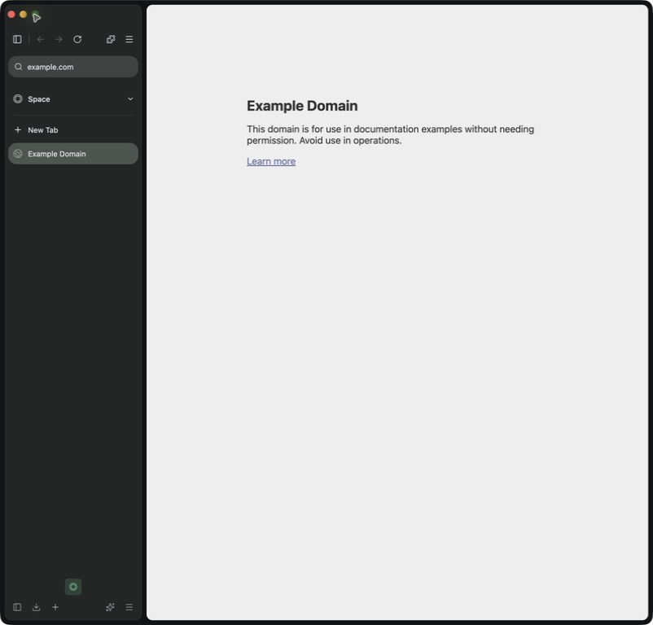
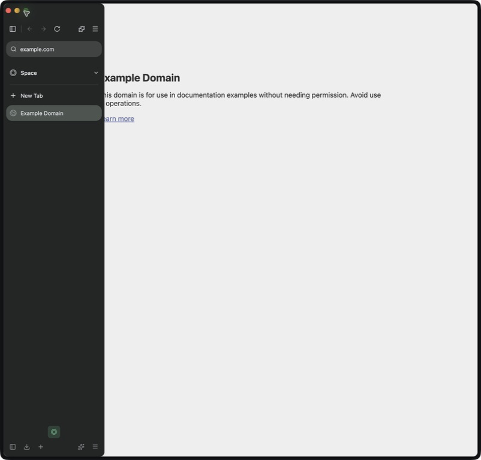
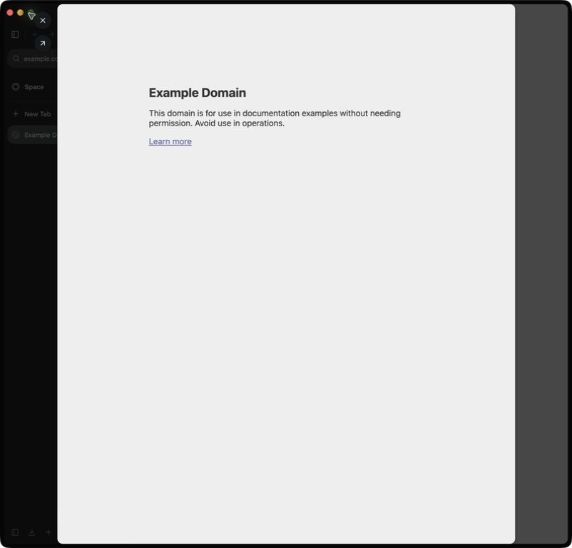
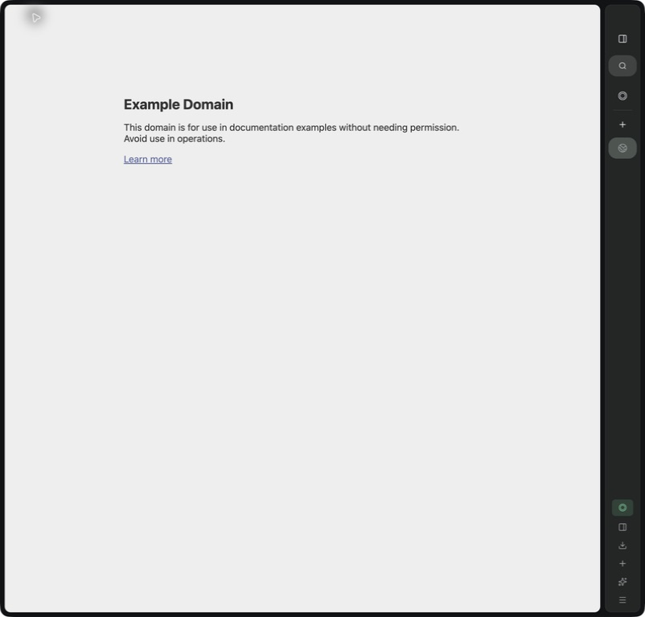

# Native-window evidence

Reference: running Zen 1.22b, BuildID 20260904060728. The original process predates the installed-package 1.22.1b update; see the append-only drift receipt in `../THIRD_PARTY_ZEN.md`. Zenmium: Electron 35.7.5, the date-branch implementation accompanying this receipt.

All eight images are JPEG whole-window captures from native macOS app capture, downsampled to 768px high by the capture tool. Window content dimensions: 1096×1050 CSS pixels, device scale factor 2. Neutral live page: `https://example.com/`. Zenmium preference baseline: dark, 230px sidebar, left, new-tab button at top, default workspace. Images are presentation evidence, not pixel-diff certification or proof of an OS drag gesture. The sidebar is left expanded except where the filename describes another state. Address captures are compact with an open floating field; right capture uses the collapsed rail.

| Zen 1.22b | Zenmium |
| --- | --- |
|  |  |
|  |  |

| Expanded | Temporary reveal |
| --- | --- |
|  |  |

| Glance | Mirrored collapsed rail |
| --- | --- |
|  |  |

`native-interactions.json` records 14 scripted integration scenarios and its explicitly unavailable native split-click probe. It is not a claim that every critical gesture passed. The full weighted acceptance matrix is in `../ZEN_FRONTEND_PARITY.md`. The latest palette color calibration is a reference-sampled fallback, not full dynamic workspace/OS theme parity.

Only generated verification profiles and neutral page content were published. No private Zen bookmarks, tabs, or history were included. The test profiles remain local for investigation; never run the setup scripts against a personal profile.
